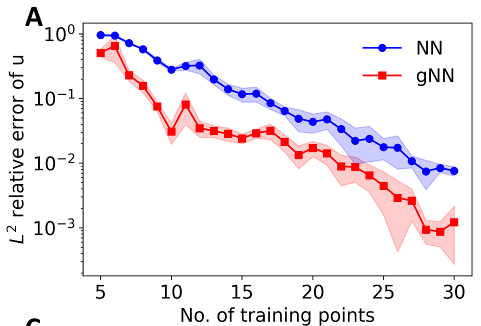
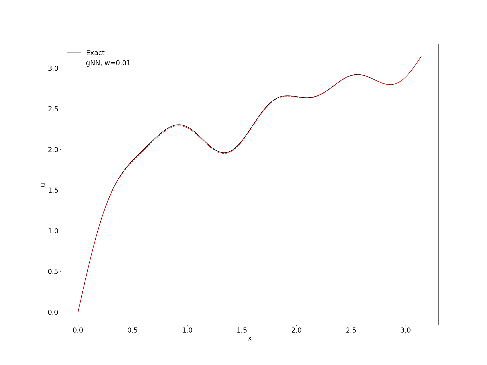
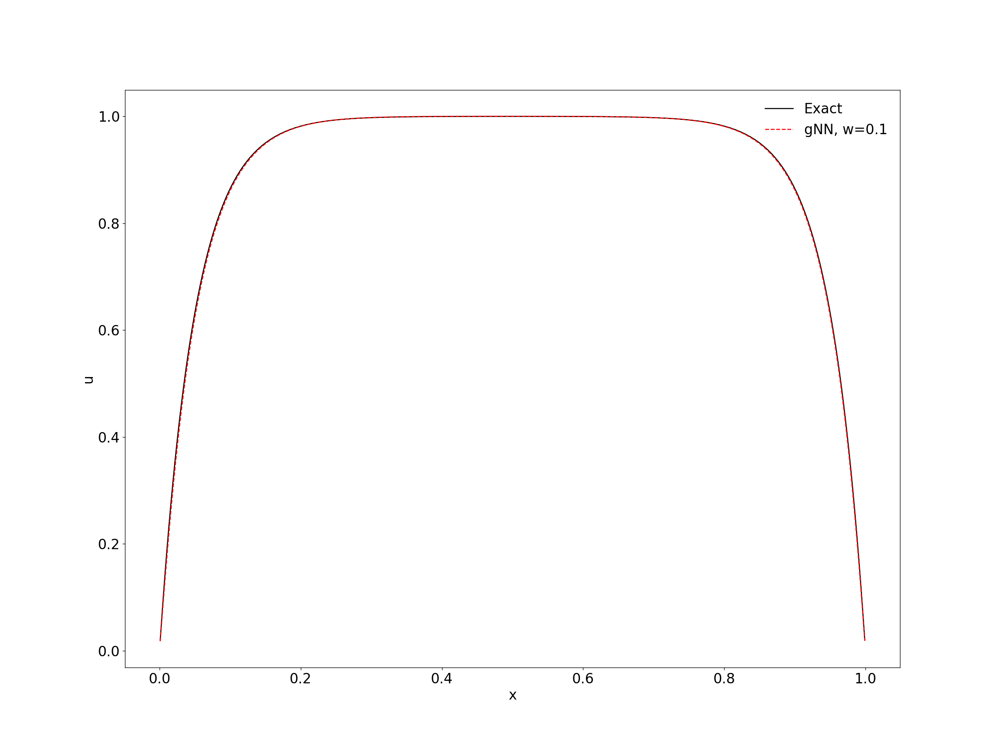

# gPINNs pytorch 复现

- ## 论文：

  ### 原文：[gPINNs](https://www.sciencedirect.com/science/article/pii/S0045782522001438?via%3Dihub)

###   源码：[Deepxde](https://github.com/lu-group/gpinn)

- ## 复现情况：

#### 1. 正向问题(Forward question)

- **Function approximation via a gradient-enhanced neural network** (Figure.1)

  $$ u(x) = −(1.4 − 3x) sin(18x), x \in [0, 1] $$

  - **Loss Function:**

    $$\mathcal{L}  = \frac{1}{n}\sum_{i = 1}^{n}\left|u(x_{i})-\hat{u}(x_{i})\right |^{2} + w_{g}\frac{1}{n}\sum_{i = 1}^{n}\left|\bigtriangledown u(x_{i})-\bigtriangledown \hat{u}(x_{i})\right |^{2}$$

### **预测对比：**

| Figure.1 C & D |                   |                   |
| :------------: | ------------------------------------------------------------ | ------------------------------------------------------------ |
|    15-u/u`     |  |  |
|    20-u/u`     |  |  |
|                |                                                              |                                                              |

### Figure.1 A & B 对比：

| Figure.1 A & B   |      |       |
| ---------------- | ---------------------------------------------- | ----------------------------------------------- |
| Figure.1  NN/gNN |  |  |
|                  |                                                |                                                 |

- **3.2.1 Poisson equation**
  $$
  \Delta u = \sum_{i=1}^{4} isin(ix) + 8sin(8x),  x\in [0, \pi]
  $$
  
  
  - **Loss Function:**
  
    $$
    \mathcal{ L = L_{f} + wL_{g} }
    $$

### **预测对比：**

| Figure.2 D & E |                   |                   |
| -------------- | ------------------------------------------------------------ | ------------------------------------------------------------ |
| 15-u/u'        |  |  |
| 20-u/u`        |  |  |

- **3.2.2 Diffusion-reaction equation**
  
  
  
  
  $$
  \frac{\partial u}{\partial t} = D \frac{\partial^2 u}{\partial x^2} + R(x, t), \qquad x \in [-\pi, \pi], t \in [0, 1]
  $$

  $$
  R(x, t) = e^{-t}[\frac{3}{2}sin(2x)+\frac{8}{3}sin(3x)+\frac{15}{4}sin(4x)+\frac{63}{8}sin(8x)]
  $$
  
  
  
  - **Loss Function:**
    
    
    
    
    $$
    \mathcal{L = L_{f}+wL_{gx}+wL_{gt}}
    $$

----

#### 2. 反向问题(Inverse problem)

- **3.3.1 Brinkman-Forchheimer model**

$$
-\frac{\nu_{e} }{\epsilon } \nabla^{2}u + \frac{\nu u}{K} = g, \qquad x \in [0, H],
$$

##### Loss Function:

$$
\mathcal{L = L_{f}+wL_{g}+L_{data}}
$$

### 预测对比：

| Figure 6. D                        |                   |
| ---------------------------------- | ------------------------------------------------------------ |
| 10 train points - 5 observe points |  |
| 20 train points - 5 observe points |  |
| 30 train points - 5 observe points |  |

