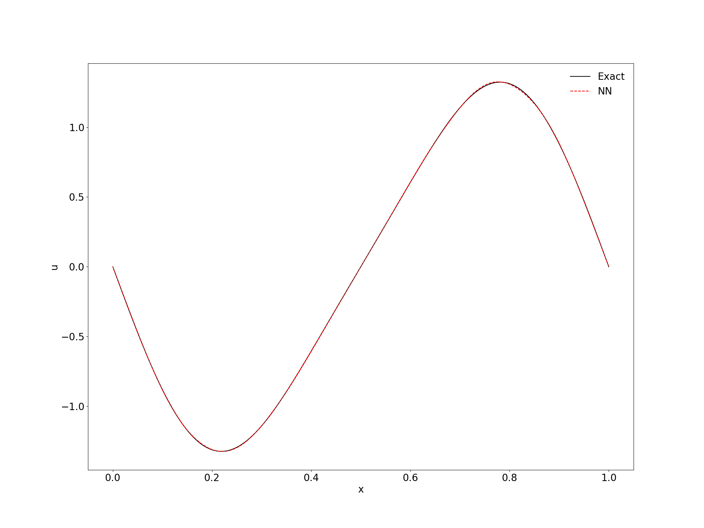
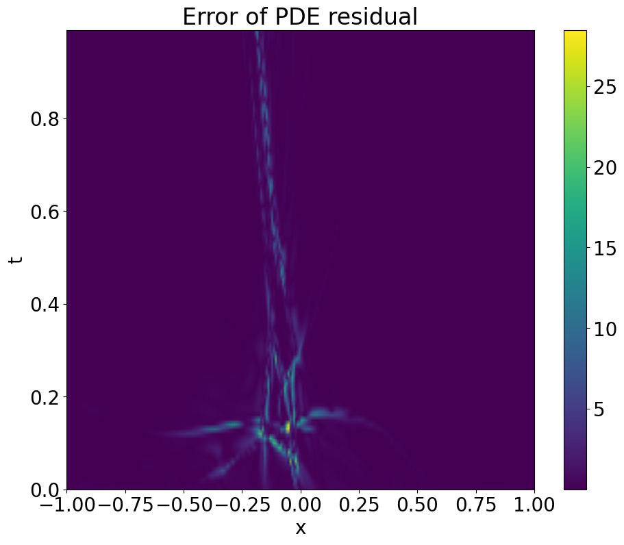
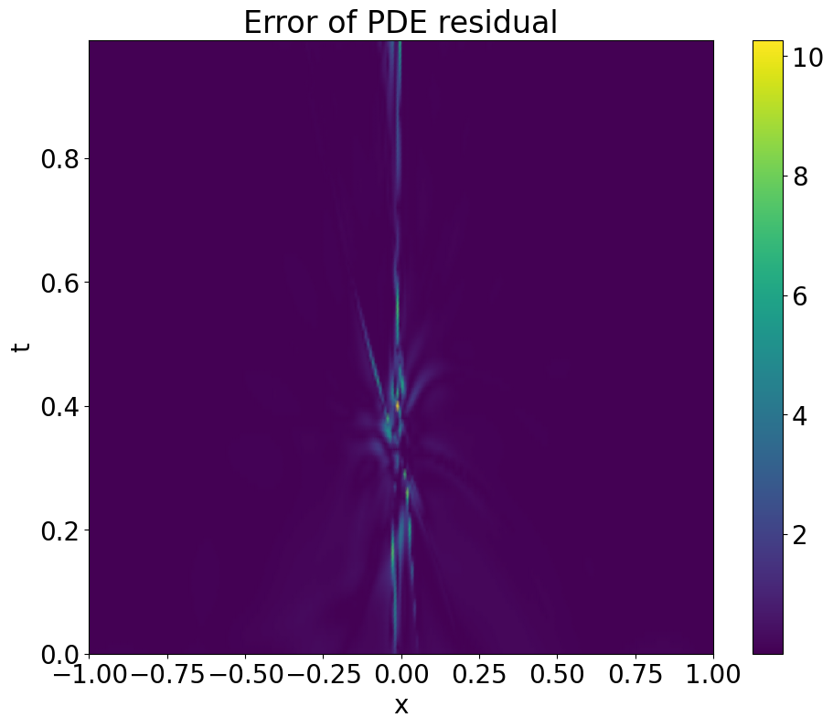
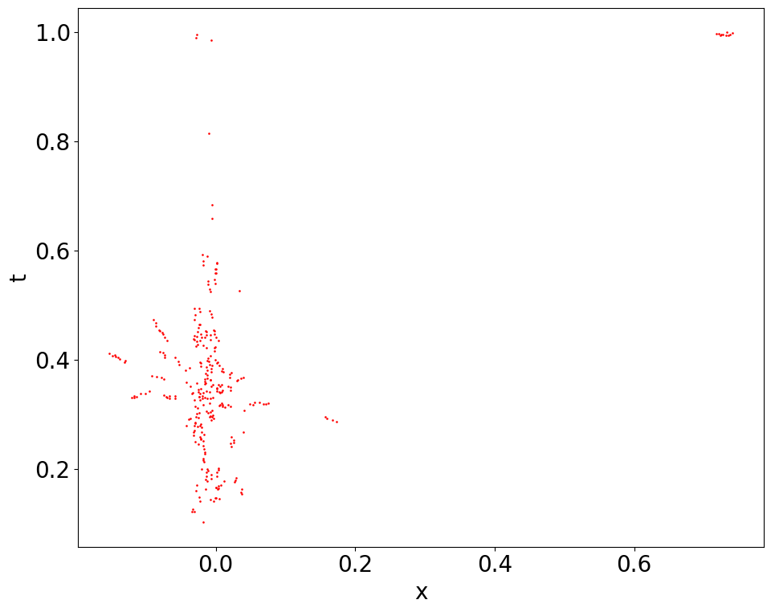

# gPINNs pytorch 复现

- ## 论文：

  ### 原文：[gPINNs](https://www.sciencedirect.com/science/article/pii/S0045782522001438?via%3Dihub)

###   源码：[Deepxde](https://github.com/lu-group/gpinn)


- ## 复现情况：


#### 1. 正向问题(Forward question)

- **Function approximation via a gradient-enhanced neural network** 

  $$
  u(x) = −(1.4 − 3x) sin(18x), x \in [0, 1]
  $$


  - **Loss Function:** 
$$
\mathcal{L}  = \frac{1}{n}\sum_{i = 1}^{n}\left|u(x_{i})-\hat{u}(x_{i})\right |^{2} + w_{g}\frac{1}{n}\sum_{i = 1}^{n}\left|\bigtriangledown u(x_{i})-\bigtriangledown \hat{u}(x_{i})\right |^{2}
$$


### 预测对比：

| Figure.1 C & D |  |  |
| :------------: | ------------------------------------------------------------ | ------------------------------------------------------------ |
|    15-u/u`     |  |  |
|    20-u/u`     |  |  |
|                |                                                              |                                                              |


### Figure.1 A & B 对比：


| Figure.1 A & B   |      |       |
| ---------------- | ---------------------------------------------- | ----------------------------------------------- |
| Figure.1  NN/gNN |  |  |
|                  |                                                |                                                 |


- **3.2.1 Poisson equation**

  $$
  \Delta u = \sum_{i=1}^{4} isin(ix) + 8sin(8x),  x\in [0, \pi]
  $$
  
  
  - **Loss Function:**
  
    $$
    \mathcal{ L = L_{f} + wL_{g} }
    $$


### **预测对比：**

| Figure.2 D & E |                   |                   |
| -------------- | ------------------------------------------------------------ | ------------------------------------------------------------ |
| 15-u/u'        |  |  |
| 20-u/u`        |  |  |


### Figure.2 A,B & C 对比：

| Figure.2 A,B & C |            |             |              |
| ---------------- | -------------------------------------------- | --------------------------------------------- | ---------------------------------------------- |
| 复现             |  |  |  |                                 


### Figure.2 F & G:


| Figure.2 F & G |           |            |
| -------------- | ------------------------------------------- | -------------------------------------------- |
| 复现           |  |  |

- 注：复现的图与论文原图情况不一致的原因是，作者是训练10次取平均的结果，而由于设备的原因，我只run了3次取平均的结果，所以可能是计算平台的差异导致的不一样的结果；但是，总体来说，在合适的权重情况下，还是gPINN的效果更好一点。

- **3.2.2 Diffusion-reaction equation**
  
  
  $$
  \frac{\partial u}{\partial t} = D \frac{\partial^2 u}{\partial x^2} + R(x, t), \qquad x \in [-\pi, \pi], t \in [0, 1]
  $$
  
  
  $$
  R(x, t) = e^{-t}[\frac{3}{2}sin(2x)+\frac{8}{3}sin(3x)+\frac{15}{4}sin(4x)+\frac{63}{8}sin(8x)]
  $$
  
  
  
  - **Loss Function:**
    
    
    $$
    \mathcal{L = L_{f}+wL_{gx}+wL_{gt}}
    $$


### 预测对比：

|  |
| ------------------------------------------------------------ |


|  |
| ----------------------------------------------------------- |

- 注：这里的gPINNs第一幅图g_wight=0.1， 第二幅图g_weight=0.01
----


### Figure.3 A,B & C,D 对比：

| Figure.3 |  |
| :------- | ------------------------------------------ |


|  |  |
| ------------------------------------------------------------ | ------------------------------------------------------------ |
|  |  |


- 对于这里当gPINN的weight分别等于1，0.1，0.01时，出现的不稳定情况，原因可能如下：
  1. 作者这里是，对于每一种模型分别训练了10次，然后取平均情况，所以最后的结果相对来说也叫稳定；而由于没有足够的计算资源，我只训练了2次取平均，所以结果相对来说也比较不稳定
  2. 梯度的计算没有优化，模型在计算梯度的过程中，存在一些累计的误差导致gPINN的权重较大时，效果不如原始的PINN


#### 2. 反向问题(Inverse problem)

- **3.3.1 Brinkman-Forchheimer model**

### case 1


$$
-\frac{\nu_{e} }{\epsilon } \nabla^{2}u + \frac{\nu u}{K} = g, \qquad x \in [0, H],
$$


##### Loss Function:


$$
\mathcal{L = L_{f}+wL_{g}+L_{data}}
$$


### 预测对比：

| Figure 6. D                        |                   |
| ---------------------------------- | ------------------------------------------------------------ |
| 10 train points - 5 observe points |   |
| 20 train points - 5 observe points |   |
| 30 train points - 5 observe points |   |


### Figure.6 A,B,C


|  |
| --------------------------------------------------- |


|  |  |  |
| ------------------------------------------------------------ | ------------------------------------------------------------ | ------------------------------------------------------------ |


### Figure.6 E

|  |  |
| ----------------------------------------------- | ------------------------------------------------------------ |


### case 2


### 预测对比：

| Figure.7 A                                          |               |
| --------------------------------------------------- | ------------------------------------------------------------ |
| 10 train points - 5 observe points pinn             |     |
| 10 train points - 5 observe points gpinn w=0.1/0.01 |  |


### Figure.7 B

|  |  |
| ----------------------------------------------- | ------------------------------------------------------------ |
|                                                 |                                                              |

 


### Figure.7 C

|  |  |
| ----------------------------------------------- | ------------------------------------------------------------ |


### When we add Gaussian noise

### 预测对比：

| Figure.8 A |               |
| ---------- | ------------------------------------------------------------ |
| 复现       |  |


### Figure.8 B

|  |  |
| ----------------------------------------------- | ------------------------------------------------------------ |


### Figure.8 C

|  |  |
| ----------------------------------------------- | ------------------------------------------------------------ |


- 3.3.2 diffusion-reaction system

### Figure 9:


| Figure A |                |
| -------- | ------------------------------------------------------------ |
| 复现     | PINN-10:gPINN-10:PINN-100: |


| Figure B |                |
| -------- | ------------------------------------------------------------ |
| 复现     | PINN-10:gPINN-10:PINN-100:gPINN-100: |


| Figure C |                |
| -------- | ------------------------------------------------------------ |
| 复现     | PINN-10:gPINN: |


----


### gPINN enhanced by RAR


#### 1. Burger`s equation


$$
\frac{\partial u}{\partial t} + u\frac{\partial u}{\partial x} = \nu \frac{\partial^2 u}{\partial x^2}, \qquad x \in [-1, 1], t \in [0, 1],\nu=0.01/pi.
$$

$$
u(x, 0) = -sin(\pi x),\qquad u(-1, t)=u(1,t)=0,
$$


### 误差对比：


| Figure.10 |  |  |
| --------- | ------------------------------------------- | ------------------------------------------------------------ |


- 注：同样这里作者是训练多次，然后取平均的结果，由于计算资源的限制，这里是我只训练了一次的结果，但是总体来说，RAR对于误差的下降还是有很明显的提升的，尤其，是对于原始PINN。


### Figure.11(distribution of residual points and absolute error `OF PINN`)


| Figure.11 |  |
| --------- | ------------------------------------------------------------ |


### Figure.11 复现：


|  |  |  |
| ------------------------------------------------------------ | ------------------------------------------------------------ | ------------------------------------------------------------ |
|  |  |  |
|  |  |  |
|  |  |  |
|  |  |  |


### Figure.12(distribution of residual points and absolute error `OF gPINN`)


| Figure.12 |  |
| --------- | ------------------------------------------------------------ |


### Figure.12 复现：


|  |  |  |
| ------------------------------------------------------------ | ------------------------------------------------------------ | ------------------------------------------------------------ |
|  |  |  |
|  |  |  |
|  |  |  |
|  |  |  |


- 出现的问题：
  1. u的误差，在x=0出反而更小
  2. 误差与原论文结果相比，精度不够


#### 2. Allen–Cahn equation


$$
\frac{\partial u}{\partial t} = D\frac{\partial^2 u}{\partial x^2} + 5(u - u^3), \qquad x\in[-1,1],t\in[0,1] 
$$


initial and boundary conditions:


$$
u(x,0)=x^2\cos (\pi x), 
$$


$$
u(-1,t)=u(1,t)=-1
$$


### 误差对比：


| Figure.13 |  |      |
| --------- | ------------------------------------------------------------ | ---- |


### Figure.14(gPINN with RAR)


| Figure.14 |  |
| --------- | ------------------------------------------------------------ |


-----


- ## 代码说明：

**针对论文的 3.1 3.2 3.3 部分的所以算例均可使用[solver.py](./solver.py)来解决，此部分代码简介如下：**

- 3.1.[Function approximation](./function.py)

- 3.2.1 [1D poisson equation](./poisson%201d.py)
- 3.2.2 [Diffusion-reaction equation](./diffusion%20reaction.py)
- 3.3.1 Brinkman-Forchheimer model
  - [Case 1](./BF1.py)
  - [Case 2](./BF2.py)

- 3.3.2 [Diffusion-reaction system](./diffusion%20reaction%20inverse.py)


**以下模块，由于需要结合RAR，统一使用solver来实现，较复杂，所以，解决方案(train, predict模块)均写在一个python文件里**

- gPINN enhanced by RAR
  - [Burgers' equation](./burger.py)
  - [Allen-Cahn equation](./allen_cahn.py)


#### 运行代码：

##### python file

默认：pinn模型来优化

（详细参数见不同问题的源代码）

- 模型中的参数说明：

```bash
usage: PINNs/gPINNs for forward diffusion reaction model [--lr LR] [--net_type NET_TYPE] [--num_epochs NUM_EPOCHS] [--resume_epoch RESUME_EPOCH]
                                                         [--num_epochs_decay NUM_EPOCHS_DECAY] [--num_train_points NUM_TRAIN_POINTS]
                                                         [--g_weight G_WEIGHT] [--output_transform OUTPUT_TRANSFORM]
                                                         [--num_supervised_train_points NUM_SUPERVISED_TRAIN_POINTS] [--test_epochs TEST_EPOCHS]
                                                         [--num_test_points NUM_TEST_POINTS] [--model_save_dir MODEL_SAVE_DIR]
                                                         [--result_dir RESULT_DIR] [--log_dir LOG_DIR] [--log_step LOG_STEP]
                                                         [--model_save_step MODEL_SAVE_STEP] [--lr_update_step LR_UPDATE_STEP]

```


- ## 复现过程中存在的问题：

  

1. 内容
2. 内容
